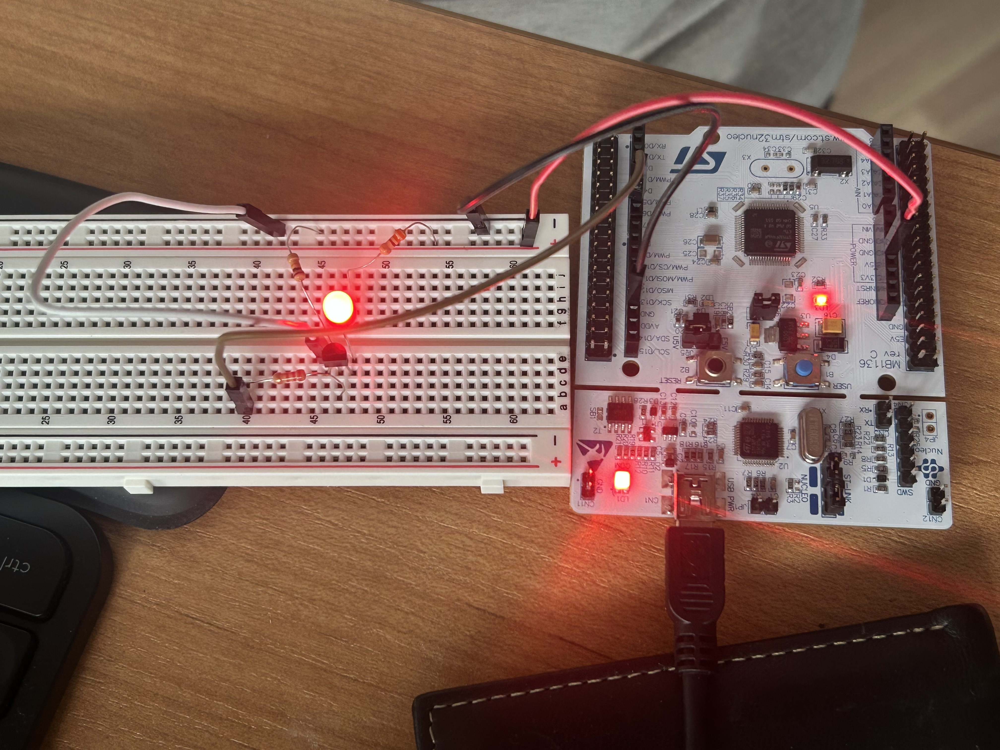
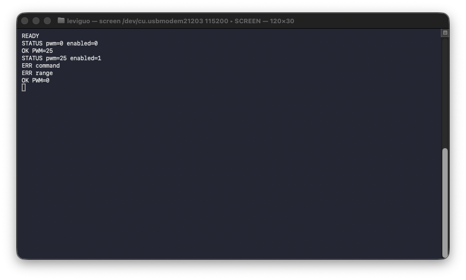

# Embedded Hardware Test and Control Platform

An STM32-based platform for controlling an external electrical load, accepting commands from a computer, and recording repeatable validation evidence.

**Built by Levi Guo** - Engineering Physics student in the Electrical Option at Queen's University, interested in embedded hardware, firmware, validation, and test automation. I am seeking a May 2027 internship in these areas.

[LinkedIn](https://www.linkedin.com/in/levi-guo741/) | [GitHub profile](https://github.com/LeviLives) | [Portfolio](https://levilives.github.io/)

## Project at a Glance

| Area | Current implementation |
|---|---|
| Controller | NUCLEO-F446RE with STM32F446RET6 MCU |
| Load stage | Externally powered LED switched by a 2N7000 MOSFET |
| Firmware | Modular embedded C using STM32 HAL |
| Control | TIM2 hardware PWM and USART2 text commands |
| Validation | DMM measurements, debugger state checks, terminal captures, photos, and video |
| Current stage | GPIO, modular control, PWM, and UART verified; Python automation and sensing are next |

The project began as a GPIO and MOSFET bring-up exercise. It now accepts live computer commands, controls output duty cycle without rebuilding the firmware, reports its commanded state, and rejects invalid input without changing the previous setting.

## System Architecture

The MOSFET lets a 3.3 V microcontroller signal control a separately powered load. A gate pulldown keeps the load off while the MCU is starting or disconnected.

## What Works Now

- [x] Safe LOW output at startup
- [x] External MOSFET and LED load switched from the STM32
- [x] Modular load-control functions separated from `main.c`
- [x] TIM2 channel 3 configured for nominal 1 kHz PWM
- [x] Five PWM settings validated with DC measurements
- [x] USART2 command interface at 115200 baud, 8N1
- [x] `PWM`, `OFF`, and `STATUS` commands
- [x] Malformed-command and range-error handling
- [x] Terminal and physical LED behavior recorded together

## UART Command Interface

The UART interface lets the output change while the firmware is running. There is no need to edit, rebuild, and flash the program for every new duty setting.

| Command | Example response | Result |
|---|---|---|
| `PWM 25` | `OK PWM=25` | Set the PWM command to 25% |
| `PWM 100` | `OK PWM=100` | Set the PWM command to 100% |
| `OFF` | `OK PWM=0` | Turn the load off |
| `STATUS` | `STATUS pwm=25 enabled=1` | Report the stored command state |
| `PWM 101` | `ERR range` | Reject an out-of-range request |
| Unknown text | `ERR command` | Reject a malformed command |

**Click the terminal image to open the 13.9-second demonstration video.** The video shows the terminal responses and external LED together while the output moves through 0%, 25%, 100%, and back to 0%.

## Measured Results

### MOSFET and load bring-up

| Measurement | Recorded value |
|---|---:|
| External supply | 4.99 V |
| MOSFET on-state drain-source voltage | 0.04 V |
| LED branch current | 9.38 mA |
| Measured series resistance | 321 ohm |

### PWM validation at PB10

TIM2 channel 3 uses an 84 MHz timer clock, prescaler 83, and period 999 for a configured frequency of 1 kHz.

| Commanded duty | Expected DC average from 3.28 V endpoint | Measured DC average |
|---:|---:|---:|
| 0% | 0.00 V | 0.00 V |
| 25% | 0.82 V | 0.82 V |
| 50% | 1.64 V | 1.64 V |
| 75% | 2.46 V | 2.46 V |
| 100% | 3.28 V | 3.28 V |

The intermediate DC readings follow the expected proportions at the recorded precision. These measurements support duty-cycle behavior, but a DMM average does not verify waveform frequency, rise time, or timing accuracy. The 1 kHz value is configured in firmware and has not yet been measured with an oscilloscope.

## What I Built and Tested

- Configured GPIO, TIM2 PWM, and USART2 in STM32CubeMX and STM32CubeIDE.
- Wired the external LED, resistor, gate resistor, pulldown, MOSFET, external supply, and common ground.
- Wrote modular C for load initialization, ON/OFF control, PWM settings, stored state, and command parsing.
- Added input validation so unsupported or out-of-range commands leave the previous setting unchanged.
- Measured the bring-up circuit and all five PWM settings with a digital multimeter.
- Recorded test procedures, calculations, problems, limitations, screenshots, photos, and video in the repository.

## Repository Guide

- [`communications.c`](firmware/stm32_controller/Core/Src/communications.c) - receives complete UART lines, parses commands, and sends responses.
- [`control.c`](firmware/stm32_controller/Core/Src/control.c) - owns the load state and applies PWM requests.
- [`main.c`](firmware/stm32_controller/Core/Src/main.c) - initializes the peripherals and repeatedly services the command interface.
- [`stm32_controller.ioc`](firmware/stm32_controller/stm32_controller.ioc) - source configuration for MCU pins, clocks, timers, and USART2.
- [`led_current.md`](hardware/calculations/led_current.md) - load-current calculation and assumptions.
- [`PWM validation report`](docs/lab_notes/pwm_validation.md) - measurements, expected values, debugging, and limitations.
- [`UART validation report`](docs/lab_notes/2026-09-22_uart_commands.md) - protocol and physical demonstration evidence.
- [`PWM walkthrough`](docs/pwm_walkthrough.md) - step-by-step explanation of the timer implementation.

## Running the Demonstration

1. Open `firmware/stm32_controller/` in STM32CubeIDE.
2. Build and flash the project to a NUCLEO-F446RE.
3. Connect to the ST-Link virtual serial port at 115200 baud, 8 data bits, no parity, and 1 stop bit.
4. Wait for `READY`, then send commands such as `STATUS`, `PWM 25`, `PWM 100`, and `OFF`.
5. Confirm each terminal response and the corresponding external LED behavior.

The serial-device name varies by computer. On macOS, it normally appears under `/dev/cu.usbmodem*`.

## Next Engineering Steps

1. Add a Python serial logger and automated PWM sweep.
2. Stream periodic telemetry for CSV capture and plots.
3. Add INA219 voltage and current sensing.
4. Add temperature sensing and calculated power.
5. Implement fault thresholds, safe shutdown, and reset behavior.
6. Capture PWM timing with an oscilloscope.
7. Move the validated design into an Altium schematic and PCB layout.

## Public Repository Scope

This public snapshot contains the firmware, calculations, lab notes, and sanitized evidence needed to reproduce the documented results. Original phone media with embedded location metadata remains only in the private development repository.
